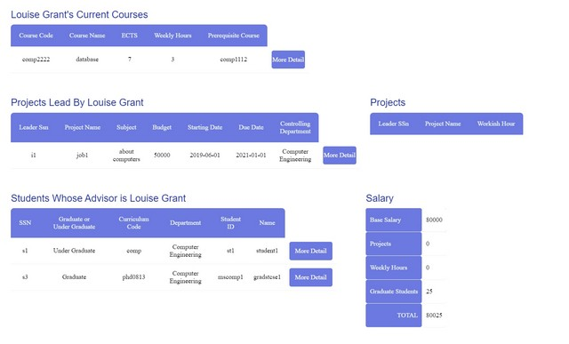

# University-Database-System

It is a online university system which allows users to see instructors - students - departments - courses - projects and their details. 
I used PHP 7.3 and HTML/CSS for implementation. 
Note: I worked with a partner in this project

<h2>Install</h2>
<ul>
        <li>Install <b>university.sql</b> in <b>db</b> folder</li>
        <li>Run in MySQL Workbench to create database</li>
        <li>Install pages in <b>main</b> folder</li>
        <li>Change the parameters in mysqli_connect function in <b>conn.php</b> according to yours</li>
        <li>Create a folder in localhost location (I use XAMPP => ..\xampp\htdocs) and copy the pages to the folder. </li>
        <li>In XAMPP Control Panel, start Apache and MySQL</li>
        <li>Go to the localhost/foldername in your browser</li>
</ul>

<h2>Some Screens</h2>
<h4>index.php</h4>

<h4>instructor-detail.php</h4>

Free Hours Report provides to bring free hours of students who take selected lesson of current instructor. In this way, If instructor wants to make make additional lesson, s/he can see the available time slots 

<h4>student-detail.php</h4>

